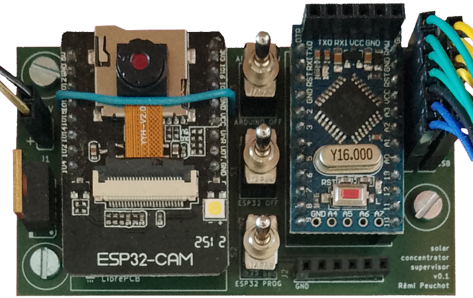

Je sais concevoir et réaliser des cartes électroniques sur mesure.

## Outils

{width=1em height=1em} Proteus PCB Design Software &nbsp; &nbsp;
{width=1em height=1em} LibrePCB &nbsp; &nbsp;
{width=1em height=1em} AISLER &nbsp; &nbsp;

## Banc de test relais

Chez [Idtsoft](http://idtsoft.fr/) j'ai conçu des cartes spécifiques pour un projet
permettant de tester automatiquement toute une gamme de relais pour la SNCF.

Le principe était de générer certains signaux spécifiques, de les aiguiller sur les bons contacts
du relais à tester et de mesurer les réactions en retour :

* temps de réponse
* courants de déclenchement
* conductivité des contacts
* test diélectriques
* réaction à certains montages électriques

## Concentrateur solaire

J'ai aussi développé une carte d'interface pour mon
[concentrateur solaire](./solar-fr.html).

